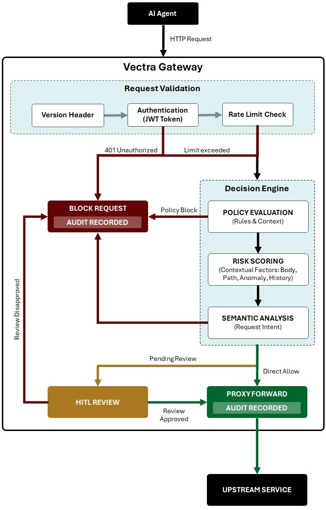

Vectra Gateway is an AI-aware API gateway designed to protect and govern requests originating from AI agents before they reach upstream services. The gateway combines traditional API security controls with contextual and semantic analysis to enforce policies, evaluate risk, and support Human-in-the-Loop (HITL) approval workflows.

The architecture is designed around four major principles:

* **Defense in depth** through layered validation and policy enforcement.
* **Context-aware decision making** using semantic and behavioral analysis.
* **Operational governance** with auditing and review workflows.
* **Controlled proxy forwarding** to upstream services.

## Core Components

### 1. AI Agent

The AI Agent acts as the client initiating requests toward protected upstream services.

Typical examples include:

* Autonomous agents
* AI copilots
* Workflow orchestrators
* LLM-powered applications
* Multi-agent systems

The gateway assumes AI-generated traffic may contain:

* Unexpected request patterns
* Prompt injection artifacts
* Unsafe actions
* Excessive automation behavior
* Privilege escalation attempts

As a result, all requests are evaluated through multiple security and governance layers.

### 2. Request Validation Layer

The Request Validation layer performs lightweight, deterministic validation before expensive contextual analysis is executed.

#### Responsibilities

**Version Header Validation:** Ensures the request targets a supported API contract version.

**JWT Authentication:** Validates the request identity and associated claims.

**Rate Limit Check:** Protects the platform and upstream systems from abuse and excessive automation.

### 3. Decision Engine

The Decision Engine is the central intelligence layer of the gateway. It evaluates requests using policy logic, contextual signals, historical behavior, and semantic interpretation.

The layered design is strong and it separates:

* Deterministic controls
* Behavioral analysis
* Intent analysis
* Governance decisions

#### Policy Evaluation

The Policy Evaluation stage determines whether a request violates explicit governance or security rules.

Typical policy inputs:

* Request path
* Request method
* Environment
* Tenant context
* Time-based rules
* Data sensitivity

Examples:

* Block access to production endpoints
* Restrict dangerous operations
* Require approval for privileged actions
* Prevent cross-tenant access

#### Risk Scoring

The Risk Scoring layer evaluates contextual risk associated with a request including:

* Request body
* Path
* Anomaly detection
* Historical behavior

This is one of the strongest parts of the architecture because AI-generated requests often require probabilistic evaluation rather than static rule checks.

#### Semantic Analysis

The Semantic Analysis stage interprets the intent of the request. This is especially important for AI-originated traffic where harmful actions may appear syntactically valid but semantically unsafe.

Example use cases:

* Detect prompt injection attempts
* Identify destructive intent
* Detect sensitive data extraction
* Recognize privilege escalation behavior
* Detect policy circumvention attempts

### 4. Decision Outcomes

The gateway produces three possible outcomes.

#### Block Request

Requests may be blocked for several reasons:

* Authentication failure
* Rate limit exceeded
* Policy violation
* High risk score
* Unsafe semantic intent
* Failed HITL review

All blocked requests are audited.

This is a strong architectural decision because:

* It supports forensic analysis
* Enables compliance reporting
* Improves explainability
* Helps train future detection models

#### HITL Review (Human-in-the-Loop)

The HITL workflow introduces a governance checkpoint for uncertain or high-risk requests. This is one of the most important differentiators in the architecture.

Use cases:

* High-impact operations
* Sensitive data access
* Production modifications
* Financial transactions
* Ambiguous semantic intent

#### Proxy Forward

Approved requests are forwarded to upstream services. This stage acts as the controlled execution boundary.