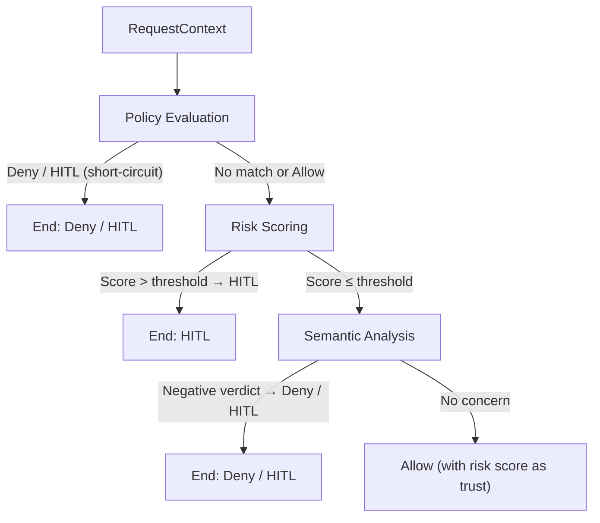

# Decision Engine

The **Decision Engine** is the central orchestrator of Vectra's governance logic. It combines policy evaluation, risk scoring, and semantic analysis into a single, ordered pipeline that produces an `Allow`, `Deny`, or `Hitl` decision for every proxied request.

---

## Evaluation Pipeline

Each stage **short-circuits** — if a stage produces a Deny or Hitl, subsequent stages are skipped.

---

## Stage 1: Policy Evaluation

Runs only if `Policy.Enabled = true`.

1. Builds an input from the `RequestContext`.
2. Evaluate `RequestContext`.
3. If the provider returns `Deny` → engine returns `Deny(reason)`.
4. If the provider returns `Hitl` → engine returns `Hitl(reason)`.
5. Otherwise, evaluation continues.

If no policy is assigned to the agent, this stage is effectively a no-op and returns `null` (continue).

---

## Stage 2: Risk Scoring

1. Compute RiskScore for `RequestContext`.
2. Compares score against `HumanInTheLoop.Threshold` (default: `0.8`).
3. If score exceeds threshold → `Hitl("High risk score: ...")`.
4. Otherwise, the score is passed to the final Allow result.

---

## Stage 3: Semantic Analysis

Runs only if `Semantic.Enabled = true`.

1. Converts the request to intent text and classifies it.
2. If the classification returns a negative / malicious verdict with confidence ≥ `ConfidenceThreshold` → Deny or Hitl.
3. If confidence is below threshold and `AllowLowConfidence = false` → Deny.

---

## Audit Trail

Every decision (Allow, Deny, Hitl) is persisted as an `AuditTrail` record containing:

- Agent ID
- Decision type and reason
- Target URL, method, path
- Risk score
- Timestamp
