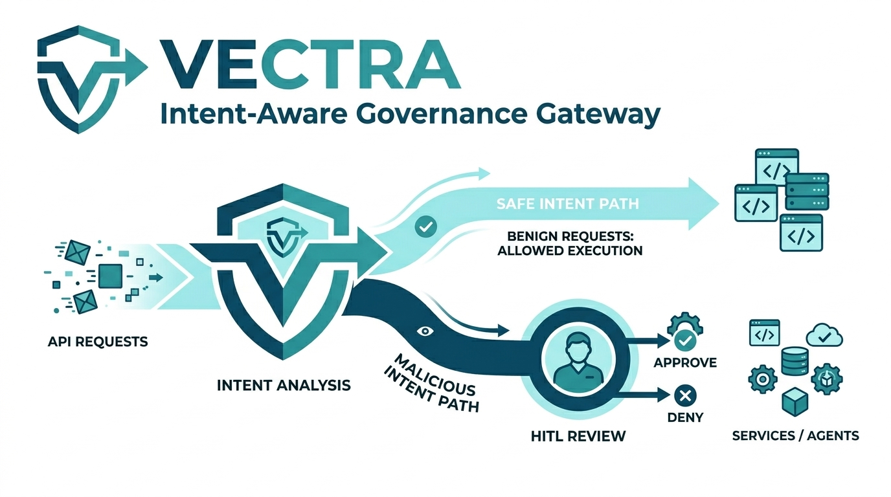
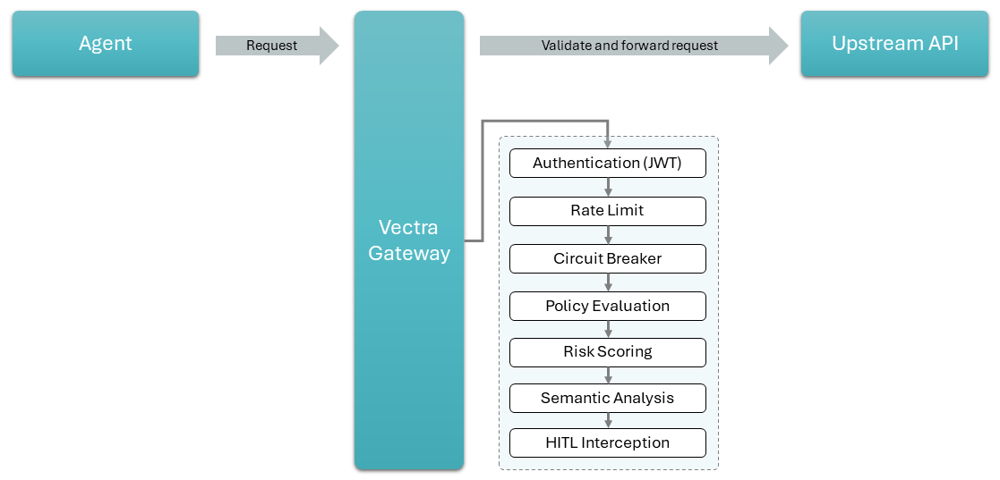

import Tabs from '@theme/Tabs';
import TabItem from '@theme/TabItem';

# VECTRA — Intent-Aware Governance Gateway

**Vectra** is an open-source **Intent-Aware Governance Gateway** built on **.NET**, designed to secure, monitor, and control interactions between autonomous AI agents, microservices, and complex backend systems.

Where traditional API gateways route traffic based on static endpoints and basic credentials, Vectra introduces a **semantic layer of security** by evaluating the *actual intent* behind every proxied API call. This allows teams to establish dynamic guardrails that ensure AI agents and automated systems operate strictly within defined behavioural boundaries.

---

## Key Capabilities

| Capability | Description |
|---|---|
| **Intent-Based Policy Enforcement** | Move beyond RBAC. Vectra analyses the underlying purpose of each request and enforces context-aware policies that govern *what* an agent is trying to achieve. |
| **Human-in-the-Loop (HITL) Safeguards** | High-risk, potentially destructive, or anomalous requests are automatically intercepted and held for a human operator to review and approve before execution. |
| **Adaptive Risk Scoring** | A composable, weighted risk-scoring engine evaluates each request across multiple dimensions — HTTP method, URL path, time-of-day, body size, and agent history. |
| **Semantic Analysis** | Optional LLM/ONNX-powered semantic evaluation classifies free-form request bodies or intent text for deeper policy decisions. |
| **Precise Agent Governance** | Each registered agent carries an identity, a trust score, and an assigned policy. The gateway enforces these per-agent rules on every proxied request. |
| **Circuit Breaker** | Protects upstream services from cascading failures by automatically opening the circuit after repeated failures and recovering automatically. |
| **Rate Limiting** | Per-agent request throttling prevents runaway agents from overwhelming downstream systems. |

---

## Why Vectra?

As organisations deploy more LLM-driven agents and complex microservices, establishing *trust* in automated workflows is critical. Vectra bridges the gap between automation and safety — letting agents act freely while keeping humans firmly in control of critical decisions.

---

## License

Vectra is open-source and licensed under the **Apache 2.0 License**.
